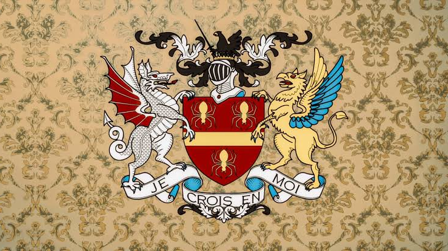

# Bem vindos Senhoras e Senhores, Damas e Cavalheiros!

<div align="center">
  
</div>

<br>

#  Olá, eu sou Drielly Santiago S2

Analista de Sistemas | Estudante de ADS com base em logística e gestão de processos

---

## 📌 Projetos em destaque

```
driellysantos@dev
```

```
sos-cidade-5p/             -> Projeto em equipe: plataforma para reportar e      [2026]
                                          acompanhar problemas urbanos da cidade.

marketplace-economia-criativa/ -> Projeto em equipe: marketplace para conectar    [2026]
                                          empreendedores da economia criativa a
                                          consumidores.

facepe/                   -> Dois projetos (bolsista e voluntária) em            [2023-2024]
                                          tecnologias logísticas, aplicando metodologias
                                          ágeis, Kanban, 5W2H e Ishikawa.
```

🔗 [SOS Cidade 5P](https://github.com/kaykyDias04/SOS_Cidade_5P) &nbsp;•&nbsp; 🔗 [Marketplace da Economia Criativa](https://github.com/thainapontes/Marketplace-da-economia-criativa)


---

## 🛠️ Tecnologias

<div align="center">
  
</div>

**Linguagens**

<p>
  
  
  
</p>

**Metodologias & Gestão**

<p>
  
  
  
  
</p>

**Ferramentas**

<p>
  
</p>

<br clear="right"/>

---


```
driellysantos@dev
```

```
-----------
Stack        : Java . TypeScript . Python . CSS
Metodologias : Kanban . Scrum . 5W2H . Ishikawa
Ferramentas  : Docker

Hobby        : Insistir no impossivel ate provar que é possivel

"No pain, no gain"
```

---

## ⚔️ Habilidades

<div align="center">
  
</div>
<ul>
<li>Gestão de fluxos e processos</li>
<li>Inteligência emocional</li>
<li>Trabalho em equipe</li>
<li>Metodologia científica</li>
<li>Proatividade</li>
<li>Adaptabilidade</li>
<li>Organização e planejamento</li>
<li>Colaboração multidisciplinar</li>
<li>Comunicação interpessoal</li>
<li>Análise de dados</li>
</ul>
<br clear="right"/>

---


<div align="center">
  <sub>Cada dia é uma nova oportunidade de viver como se fosse a primeira vez
  </sub>
</div>
