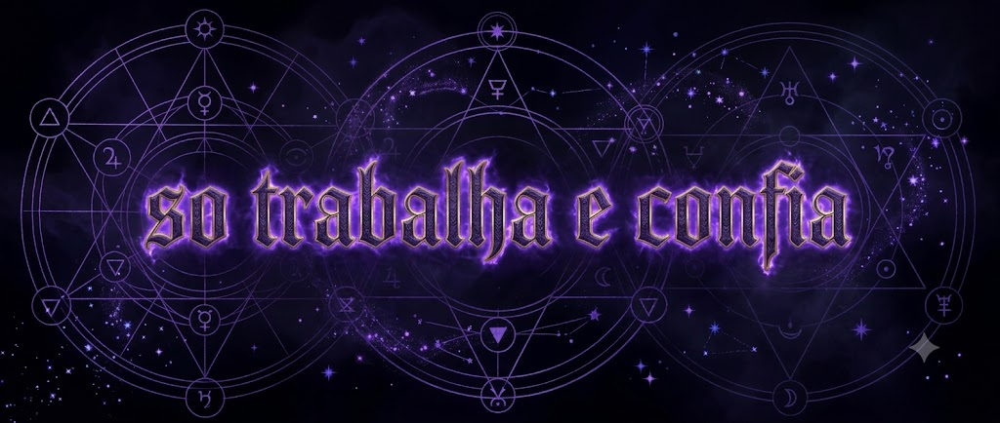
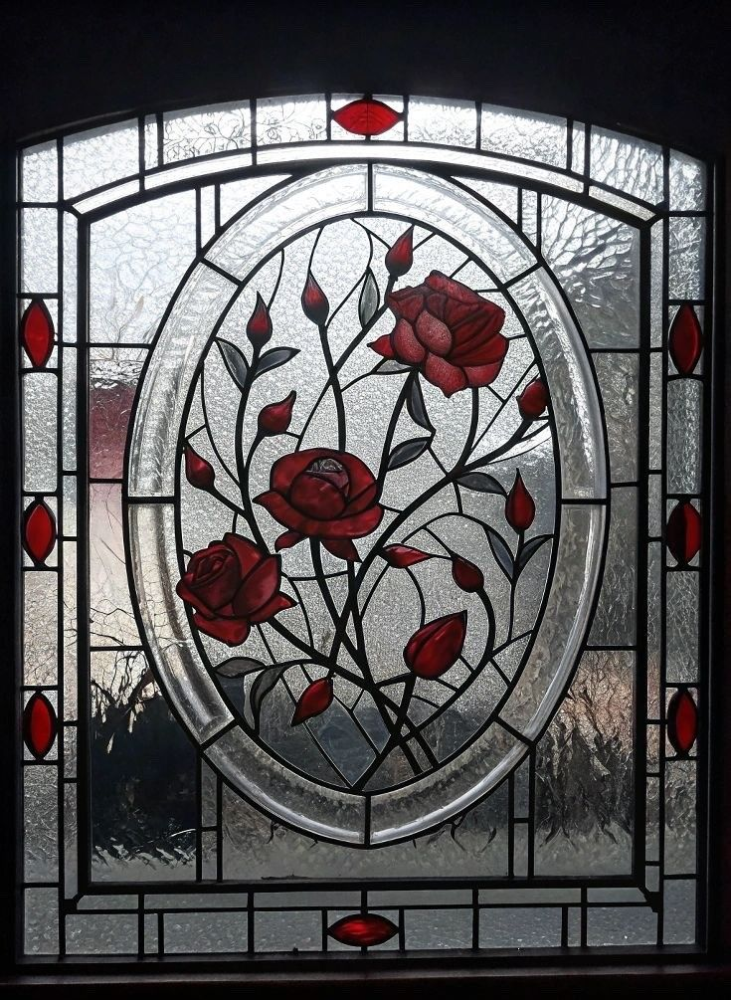
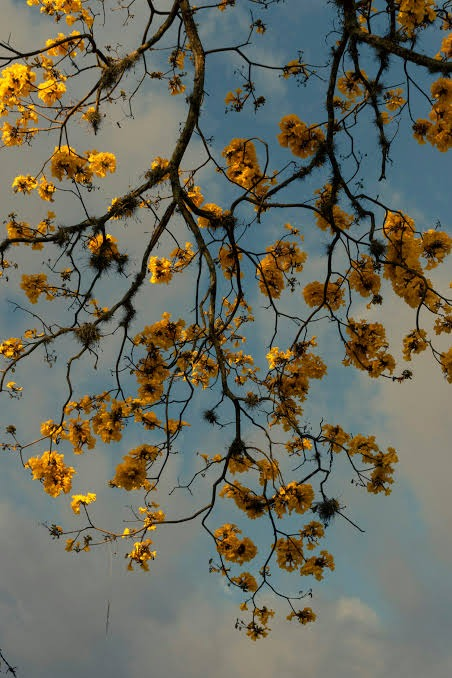
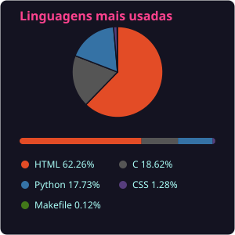

<div align="center">
  

  <h1>Olá, eu sou Drielly Santiago</h1>

  <p><strong>Analista de Sistemas em formação</strong><br/>
  Estudante de ADS com base em logística e gestão de processos</p>

  <p>
    <a href="mailto:driellysantos578@gmail.com">E-mail</a> &nbsp;•&nbsp;
    <a href="https://www.linkedin.com/in/driellysantos/">LinkedIn</a>
  </p>
</div>

---

## 📌 Sobre mim

Estudo Análise e Desenvolvimento de Sistemas na Cesar School e trago uma base sólida em logística e gestão de processos. Meu foco é transformar necessidades de negócio em soluções tecnológicas por meio de **modelagem e diagramação**, e organizar o trabalho com metodologias ágeis.

Estou em busca de **estágio ou posição júnior** em desenvolvimento e análise de sistemas.

---

## Projetos em destaque

<table>
<tr>
<td width="300" valign="middle" align="center">
  
</td>
<td valign="middle">

**SOS Cidade 5P** · 2026 · projeto em equipe
Plataforma para reportar e acompanhar problemas urbanos da cidade.
- **Minha atuação:** revisão, implementação e correção de segurança (autenticação e senhas, chave JWT, criação de contas de gestor, anonimização de dados), além da análise de LGPD e da documentação de requisitos de segurança.

🔗 [Repositório](https://github.com/EllySantiago/SOS_Escola_5P.-copy)

**Origem — Marketplace da Economia Criativa** · 2026 · projeto em equipe
Marketplace que conecta empreendedores da economia criativa de Pernambuco a consumidores.
- **Minha atuação:** backlog priorizado (MoSCoW e histórias de usuário), diagrama de caso de uso e DER, requisitos de interface e início do frontend em Next.js.
- Desenvolvido com apoio de ferramentas de IA, com revisão manual dos resultados.

🔗 [Repositório](https://github.com/EllySantiago/Marketplace-da-economia-criativa)

**FACEPE** · 2023–2024 · bolsista e voluntária
Dois projetos em tecnologias logísticas. Levantei informações, entendi as dores da empresa atendida e propus melhorias usando Kanban, 5W2H e Ishikawa.

</td>
</tr>
</table>

---

## 🛠️ Tecnologias e métodos

<table>
<tr>
<td valign="middle">

```
driellysantos@dev:~$ stack --list
```

```
-----------
Linguagens   : Java . TypeScript . Python
Front-end    : HTML5 . CSS
Modelagem    : Diagramação . Figma
Metodologias : Kanban . Scrum . 5W2H . Ishikawa
Ferramentas  : Docker

Hobby        : Insistir no impossível até provar que é possível

"No pain, no gain"
```

</td>
<td width="300" valign="middle" align="center">
  
</td>
</tr>
</table>

---

## ⚔️ Habilidades

<table>
<tr>
<td width="300" valign="middle" align="center">
  
</td>
<td valign="middle">

- Gestão de fluxos e processos
- Análise de dados
- Metodologia científica
- Organização e planejamento
- Trabalho em equipe e colaboração multidisciplinar
- Comunicação interpessoal
- Inteligência emocional
- Proatividade e adaptabilidade

</td>
</tr>
</table>

---

## 🎓 Formação e idiomas

<table>
<tr>
<td valign="middle">

- **Cesar School** · Tecnólogo em Análise e Desenvolvimento de Sistemas · 2025–2027
- **ETEPAM** · Ensino médio técnico em Logística · 2020–2022
- **Idiomas:** inglês intermediário (B1), francês e espanhol básicos

</td>
<td width="300" valign="middle" align="center">
  
</td>
</tr>
</table>

---

<p align="center">
  
</p>

<div align="center">
  <picture>
    <source media="(prefers-color-scheme: dark)" srcset="https://raw.githubusercontent.com/EllySantiago/EllySantiago/output/github-snake-dark.svg"/>
    
  </picture>
</div>

<div align="center">
  <sub>Cada dia é uma nova oportunidade de viver como se fosse a primeira vez</sub>
</div>
